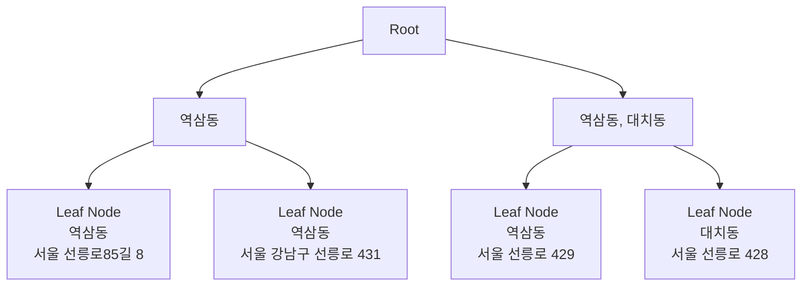

### 📌 상위 주소 (예: 서울시)를 좀 더 빨리 판단할 수 있는 방법이 있나?

---

#### ✅ 1. 가장 간단한 방법

- **시군구 shp 파일**로 별도의 트리를 생성하여 검색
    
- 약 **20MB** 수준의 파일이므로, **충분히 고려해볼 만한 선택지**로 판단됨
    

---

#### ✅ 2. 같은 트리를 사용해야 한다면

1. **부모 노드를 만들 때**, 하위 노드들의 메타데이터를 **요약하여 부모 노드에 포함**시킴
    
2. 예: 동 정보 요약
    

---

#### 💡 예시 설명

- 검색 과정에서 왼쪽 트리(예: `A1`)를 타게 되면  
    → Leaf Node 까지 가지 않고 **바로 ‘역삼동’이라는 정보**를 빠르게 파악 가능함
    
