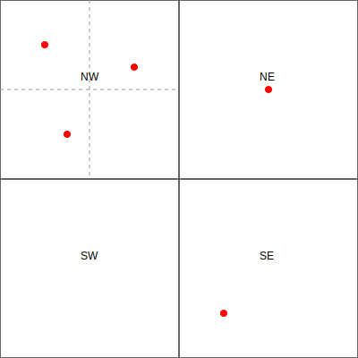
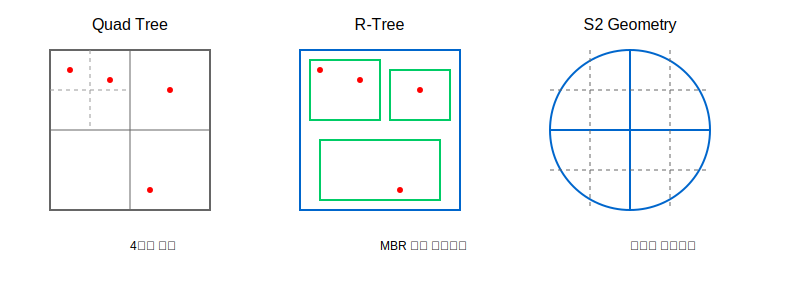
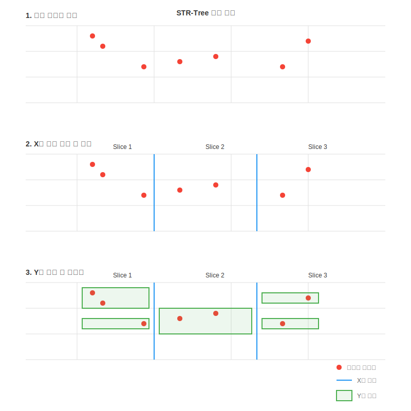

# 역지오코딩(Reverse Geocoding) 기술 문서

## 1. 역지오코딩 개요

역지오코딩(Reverse Geocoding)은 위도와 경도 좌표를 실제 주소나 장소로 변환하는 프로세스입니다. 일반적인 지오코딩이 주소를 좌표로 변환하는 것과 반대되는 개념입니다.

### 주요 활용 분야

- 위치 기반 서비스(LBS)
- 내비게이션 시스템
- 배달/물류 서비스
- 위치 기반 분석

### 핵심 요구사항

- 높은 정확도
- 빠른 응답 시간
- 대용량 데이터 처리

## 2. 공간 인덱싱 기법 비교

### Quad Tree



```
         root
        /  |  \
    NW  NE  SW  SE
```

- **구조**: 2차원 공간을 4개의 영역으로 재귀적으로 분할
- **장점**:
    - 구현이 상대적으로 간단
    - 동적 갱신이 용이
    - 메모리 사용이 효율적
- **단점**:
    - 불균형한 데이터 분포에서 성능 저하
    - 깊이가 깊어질 수 있음
- Linear Quad Tree
    - Space Filling Curve 를 이용해 낭비를 줄이고 깊이를 일정하게 만든 트리

### R-Tree


- **구조**: 다차원 공간 데이터를 위한 트리 구조
- **장점**:
    - 공간 데이터에 최적화
    - 범위 검색 성능이 우수
    - 균형 잡힌 구조 유지
- **단점**:
    - 구현이 복잡
    - 삽입/삭제 시 오버헤드

### S2 Geometry

- **구조**: 구면을 계층적 사각형으로 분할
- **장점**:
    - 구면 기하학에 최적화
    - 정확한 거리 계산
    - 글로벌 서비스에 적합
- **단점**:
    - 학습 곡선이 높음
    - 구현이 복잡
    - 메모리 사용량이 큼

### 시각화 비교



위 이미지들은 각 인덱싱 기법의 특징을 시각적으로 보여줍니다:

- Quad Tree: 공간을 4분할하여 재귀적으로 구성
- R-Tree: 최소 경계 사각형(MBR)을 이용한 계층적 구조
- S2: 구면을 계층적 사각형으로 분할하는 방식

## 3. R-Tree 구현 기법

#### 삽입 (Insert) 과정

1. **최적 삽입 위치 선택**

    - 새로운 객체의 MBR을 계산
    - 루트 노드부터 시작하여 재귀적으로 최적의 삽입 위치 (리프 노드)를 탐색
    - 각 레벨에서 최소 면적 증가 (Least Enlargement) 자식 노드 선택

2. **노드 분할 처리**

    - 선택된 노드가 최대 용량을 초과하면 분할 수행
    - 분할 알고리즘 (Linear Split, Quadratic Split, Ang-Tan Linear Split 등) 적용
    - 분할된 두 노드의 MBR 계산

3. **부모 노드 갱신**
    - 삽입/분할로 인한 MBR 변화를 부모 노드에 반영
    - 루트까지 재귀적으로 MBR 갱신
    - 필요한 경우 루트 노드도 분할

#### 노드 분할 알고리즘

##### Linear Split

- X/Y 축 기준 가장 멀리 떨어진 두 노드를 기준으로 분리
- 분할 품질이 상대적으로 낮지만 속도가 빠름

##### Quadratic Split

- 한 MBR 에 속하면 낭비되는 공간이 가장 큰 두 노드를 기준으로 분리

#### R\*-tree

- 삽입시 최소 면적 증가 뿐만 아니라 겹침, 경계면 등을 고려
- 마진, 중첩, 면적을 모두 고려하여 분할
- 일부 객체를 제거하고 루트에 다시 삽입 (reinsertion)
- _삽입/삭제 연산이 더 복잡하지만 읽기 연산에서 더 높은 성능_

#### 검색 (Search) 과정

- "필터 및 정제 원칙(Filter and Refine Principle, FRP)"에 따라 두 단계로 이루어집니다.

1. Filter
    - 트리 루트부터 재귀적으로 각 노드의 MBR 과 검색 쿼리 범위가 겹치는지 확인
    - 리프 노드에서 실제 공간 객체의 MBR 을 비교하여 결과 집합(result set) 에 추가
2. Refine
    - 결과 집합의 공간 객체를 대상으로 정확하고 정제된 평가 수행

## 4. STR-Tree (Sort-Tile-Recursive)

STR-Tree는 벌크 로딩에 최적화된 R-Tree 변형입니다.

### 생성 과정



STR-Tree의 생성 과정은 다음과 같은 단계로 이루어집니다:

1. **초기 데이터 준비**

    - 모든 공간 객체들을 메모리에 로드
    - 각 객체의 MBR(Minimum Bounding Rectangle) 계산

2. **X축 정렬 및 분할**

    - 모든 객체를 X축 좌표를 기준으로 정렬
    - ⌈N/M⌉ 개의 슬라이스로 분할 (N: 전체 객체 수, M: 노드당 최대 객체 수)

3. **Y축 정렬 및 그룹화**

    - 각 슬라이스 내에서 객체들을 Y축 좌표로 정렬
    - M개씩 그룹화하여 리프 노드 생성
    - 각 그룹의 MBR 계산

4. **상위 레벨 생성**
    - 생성된 노드들을 다시 STR 알고리즘을 적용하여 상위 레벨 구성
    - 루트 노드가 생성될 때까지 반복

### 성능 특성

- **장점**

    - 벌크 로딩 시 최적의 성능 (O(N log N))
    - 균형 잡힌 트리 구조 보장
    - 노드 간 중첩 최소화
    - 공간 활용도가 높음

- **단점**
    - 동적 갱신이 어려움
    - 전체 데이터셋이 메모리에 있어야 함
    - 정렬 과정에서 메모리 사용량이 큼

### 활용 사례

- 대용량 공간 데이터의 초기 인덱스 구축
- GIS 시스템의 공간 검색
- 위치 기반 서비스의 데이터 구조화

## 5. Elasticsearch BKD-Tree

BKD-Tree(Block K-D Tree)는 Elasticsearch에서 사용하는 공간 인덱싱 구조입니다.

Working...